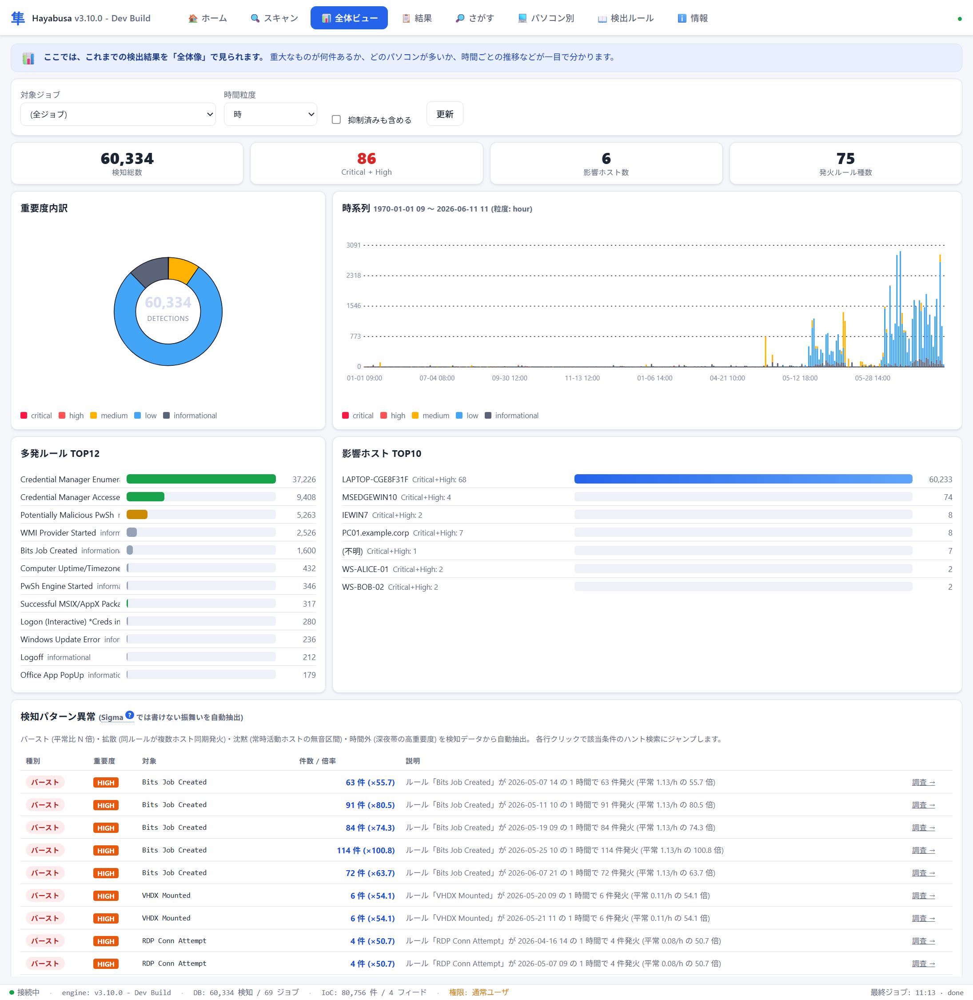
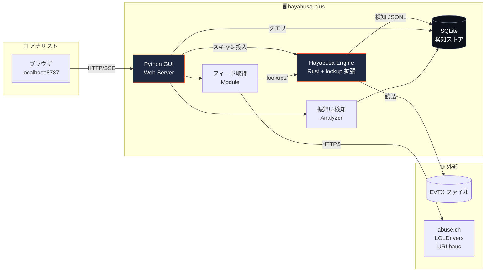
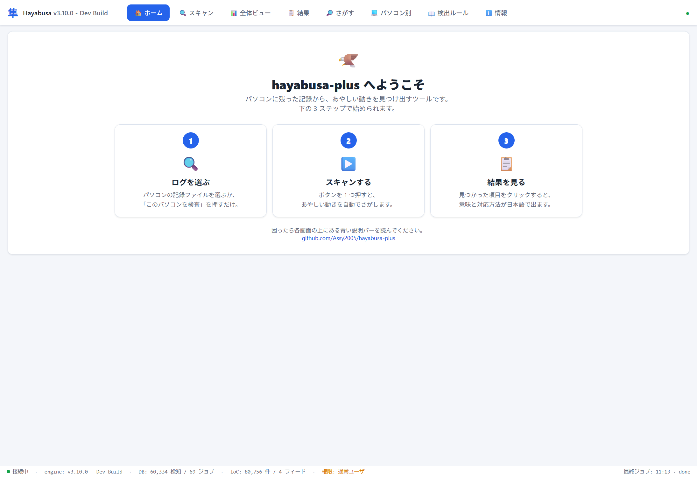
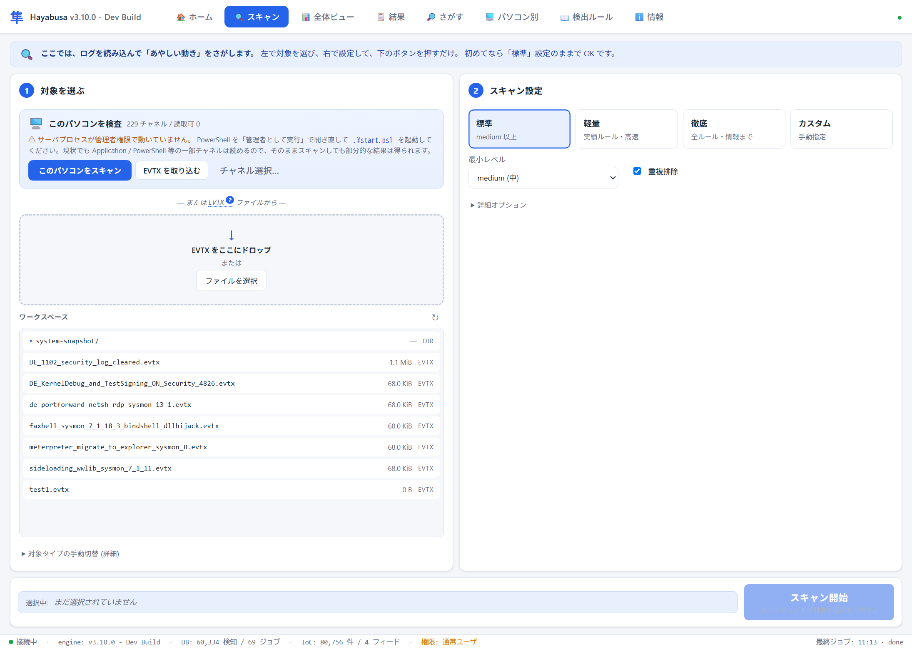
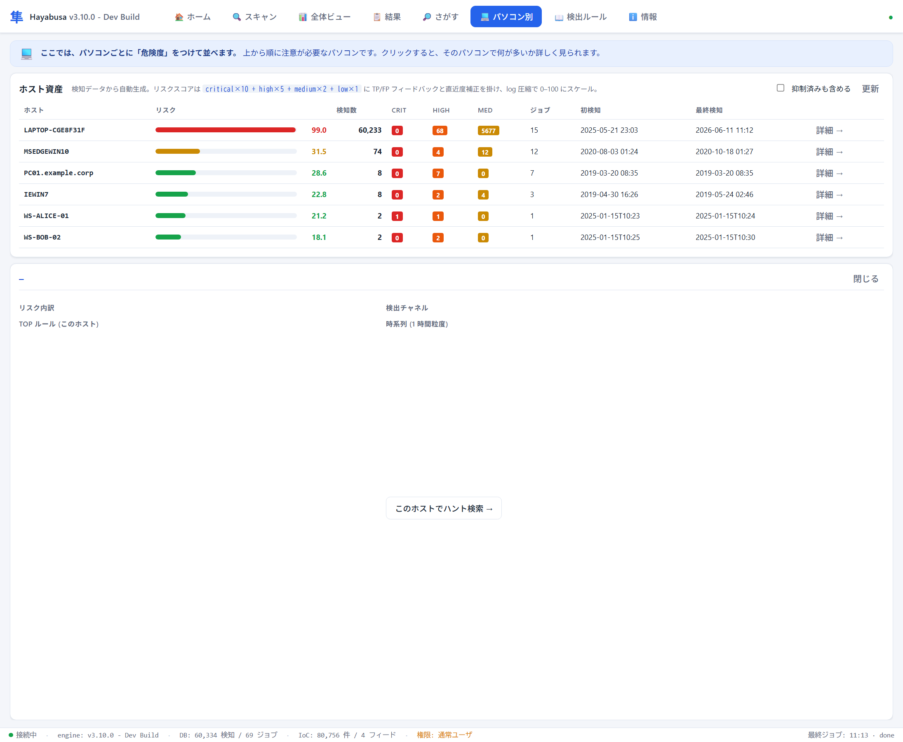
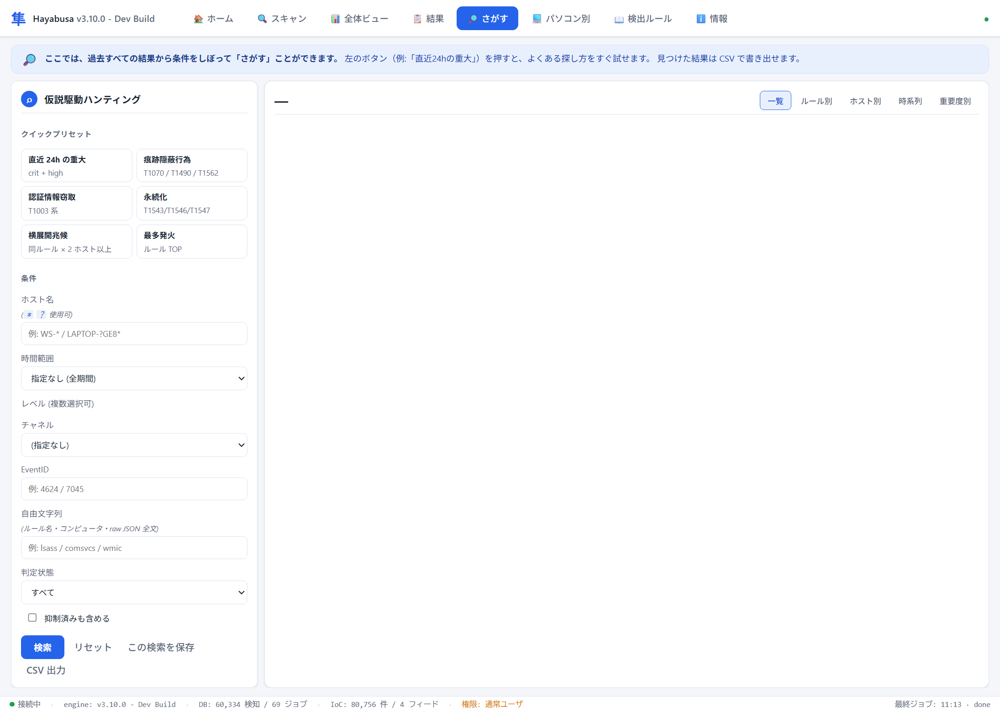

<div align="center">

# 🦅 hayabusa-plus

**Hayabusa を拡張した、ブラウザで使う DFIR 解析プラットフォーム**

Sigma 検知エンジンに `lookup:` 拡張を足し、ローカル Web UI から
**スレットハンティング・プロセスツリー追跡・振舞い異常検知・IoC フィード自動取込** までを一画面で。


<br/>



</div>

---

## 📌 一行で

> **EVTX を投げ込むだけで、Sigma 検知 + IoC フィード照合 + 攻撃の系統再構築 + 異常パターン抽出を行うローカル DFIR コンソール。**

エンドポイントに常駐させず、収集された EVTX を後追いで深く解析する **DFIR ワークベンチ** として設計されています。

---

## 🎯 解決したい問題

| 既存ツールの課題 | hayabusa-plus のアプローチ |
|---|---|
| Hayabusa CLI は強力だが結果は CSV/JSON の山。手で grep / Excel で開く運用 | 結果を **SQLite に正規化** → 多軸絞り込み + ピボット + CSV 出力 |
| ある検知を見ても **何が起きているか** が分かりにくい | 検知ごとに **「なに?」「重要度」「ATT&CK」「次にすべきこと」** をクリックで展開 |
| Sigma 単体だと 1 イベント単位の判定しかできない | **振舞い検知** (バースト・拡散・沈黙・時間外) を集計で抽出 |
| IoC フィードを取り込みたいがルール書き換えが面倒 | **`lookup:` 拡張** で外部ファイル参照、フィードは GUI/CLI から定期更新 |
| プロセスの系統が分からない | 検知発生時刻 ±N 分の Sysmon EID 1 から **親子ツリーを自動構築** |
| 「攻撃者はログを消す」前提が抜けがち | **痕跡隠蔽検知ルール 5 本** + ARCHITECTURE.md にアンチエヴェイジョン専用章 |

---

## ✨ 主な機能

<table>
<tr>
<td width="50%" valign="top">

### 🔎 解析・調査
- **EVTX ドロップ & ドロップ** → 即スキャン
- **ライブフィード** — 検知をリアルタイム表示
- **このパソコンを検査** — System32\winevt\Logs を直接解析、または重要チャネルを workspace へスナップショット
- **検知解説パネル** — 1 クリックで定義・誤検知例・ATT&CK 日本語・推奨次手を展開
- **プロセスツリー再構築** — Sysmon EID 1 から親子ツリー、focal をハイライト

</td>
<td width="50%" valign="top">

### 🎯 ハンティング・運用
- **多軸検索** — ホスト glob / 時間範囲 / レベル / ルール / ATT&CK / EID / 自由文字列
- **6 個のクイック仮説プリセット** — 直近 24h 重大 / 痕跡隠蔽 / 認証情報窃取 / 永続化 / 横展開 / 最多発火
- **ピボットビュー** — ルール別 / ホスト別 / 時系列 / 重要度別
- **TP / FP フィードバック** — `lookups/fp_history/` に蓄積
- **抑制ルール** — ホスト × ルール単位、JSON でバージョン管理可
- **CSV エクスポート** — Excel 互換 (BOM 付き UTF-8)

</td>
</tr>
<tr>
<td valign="top">

### 📊 ダッシュボード
- KPI (検知総数 / Critical+High / 影響ホスト数 / 発火ルール種数)
- 重要度ドーナツ + 時系列スタック棒 (SVG、外部ライブラリ依存ゼロ)
- TOP ルール / TOP ホスト水平バー
- **検知パターン異常カード** — Sigma では書けない振舞いを自動抽出

</td>
<td valign="top">

### 🛡️ IoC フィード自動取込
- **4 フィード** 統合済 (LOLDrivers / MalwareBazaar / URLhaus / Feodo)
- **82,679 件の IoC** をワンクリックで取得
- 取得失敗時は **既存ファイル温存** (検知継続)
- GUI ボタン or `tools/fetch_feeds.py` 経由

</td>
</tr>
</table>

---

## 🏗️ アーキテクチャ



---

## 🖼️ 画面イメージ

> いずれもブラウザ (`http://127.0.0.1:8787`) 上で動作。外部ライブラリ・ビルド不要の素の HTML / CSS / SVG。

### 🏠 ホーム — 予備知識ゼロでも 3 ステップで始められる

専門用語を出さず「ログを選ぶ → スキャン → 結果を見る」の 3 枚カードで導線を提示。各画面上部にも平易な説明バーを常設。



### 🔍 スキャン — 対象選択から実行まで 1 画面で完結

EVTX をドロップ、または **「このパソコンを検査」** をワンクリック。プリセット (標準 / 軽量 / 徹底 / カスタム) と詳細オプション、解析中は **推定 % 付きプログレスバー + 中止ボタン**。



### 📊 全体ビュー — 検出結果の全体像をひと目で

KPI (検知総数 / Critical+High / 影響ホスト数 / 発火ルール種数)、重要度ドーナツ、時系列スタック棒、TOP ルール / TOP ホスト、そして **Sigma では書けない振舞い異常 (バースト・拡散・沈黙・時間外) の自動抽出**。


### 💻 パソコン別 — ホスト単位のリスクスコアで「危ない端末」を即特定

重要度・TP/FP・新しさ・ログ圧縮を加味した加重スコアで端末をランキング。クリックでそのホストのハント検索へ。



### 🔎 さがす — 仮説駆動ハンティング

6 個のクイックプリセット (直近24hの重大 / 痕跡隠蔽 / 認証情報窃取 / 永続化 / 横展開 / 最多発火) + ホスト glob・時間・レベル・チャネル・EID・自由文字列の多軸フィルタ。結果はルール別 / ホスト別 / 時系列 / 重要度別にピボット、CSV 出力も。



## 🚀 クイックスタート

> **🟢 一番簡単（推奨）:** [最新リリース](https://github.com/Assy2005/hayabusa-plus/releases/latest) から
> `hayabusa-plus-vX.Y.Z-win-x64.zip` をダウンロード → 展開 → `.\start.ps1`。
> エンジン (lookup 拡張入り) とルールが同梱済みなので、Rust ビルドは不要です。
> 開発版から動かしたい場合は以下の手順で。

### 1. Clone

```powershell
git clone https://github.com/Assy2005/hayabusa-plus.git
cd hayabusa-plus
```

### 2. Hayabusa バイナリ配置

<table>
<tr>
<td><b>選択肢 A:</b> 公式 release を使う</td>
<td>

```powershell
# https://github.com/Yamato-Security/hayabusa/releases から
# hayabusa-3.x.x-win-x64.zip を取得して bin/ に展開
```

</td>
</tr>
<tr>
<td><b>選択肢 B:</b> 自前ビルド (lookup 拡張あり) </td>
<td>

```powershell
cd engine
cargo build --release
Copy-Item target\release\hayabusa.exe ..\bin\hayabusa-fx-3.10.0.exe
cd ..
```

</td>
</tr>
</table>

### 3. カスタムルール展開 + IoC フィード取得

```powershell
mkdir bin\rules\hayabusa\custom -ErrorAction SilentlyContinue
Copy-Item rules-custom\*.yml bin\rules\hayabusa\custom\

# IoC フィードを取得 (約 8 万件の IoC が手元に揃う)
python tools\fetch_feeds.py
```

### 4. 起動

```powershell
.\start.ps1
```

ブラウザが `http://127.0.0.1:8787` で開きます。「このパソコンを検査」を使うときは **管理者として起動した PowerShell** から実行してください。

### 🐧 Linux / WSL で動かす

```bash
git clone https://github.com/Assy2005/hayabusa-plus.git
cd hayabusa-plus

# 1) フォーク版エンジン (lookup 拡張入り) を Linux 向けにビルド (Rust が必要)
bash tools/build_engine_linux.sh          # → bin/hayabusa-fx を生成

# 2) Sigma ルールが未取得なら取得し、もう一度ビルドスクリプトで custom を配置
./bin/hayabusa-fx update-rules ./bin/rules
bash tools/build_engine_linux.sh

# 3) IoC フィード取得 (任意・約 8 万件)
python3 tools/fetch_feeds.py

# 4) 起動
./start.sh
```

`http://127.0.0.1:8787` が立ち上がります。**EVTX をアップロードして解析**してください
（`「このパソコンを検査」`＝ライブ解析は Windows 専用機能なので Linux では無効です）。

### 🌐 ネットワークに公開する（研究室の共有機にする）

研究室の PC で起動し、同じ LAN の誰でもブラウザからログを調べられるようにできます。

```bash
./start.sh --public               # 0.0.0.0 で待受 (LAN 公開)
# PORT=8080 ./start.sh --public   # ポート変更
# Windows でも:  $env:HAYABUSA_GUI_HOST="0.0.0.0"; .\start.ps1
```

起動時に共有用 URL（例 `http://192.168.x.x:8787`）が表示されるので、それを参加者に伝えるだけです。

> ⚠️ **公開モードは認証がありません。** 同じ LAN の誰でもログのアップロード・スキャン・
> **全削除**ができます。**信頼できる LAN 内でのみ**使い、インターネットには晒さないでください。
> （DNS リバインド防御は公開モードで外れますが、別サイト経由の CSRF=POST/DELETE は同一
> オリジンチェックで引き続きブロックします。ライブ解析も公開モードでは無効です。）

---

## 🔧 エンジン拡張: `lookup:`

upstream Hayabusa に **外部 IoC ファイル参照** の機能を追加しました。ルール 1 行で 8 万件のフィードを参照できます。

```yaml
title: Known vulnerable driver loaded (LOLDrivers hash match)
lookup:
  - name: lol_drivers
    file: ../../../../lookups/loldrivers.txt        # ← 1,924 件の SHA-256
detection:
  sel:
    Channel: 'Microsoft-Windows-Sysmon/Operational'
    EventID: 6
    Hashes|lookup: lol_drivers                       # ← 部分一致で発火
  condition: sel
level: critical
```

エンジン側の主な変更:
- `engine/src/detections/rule/lookup.rs` (新規) — 起動時にロード、`RwLock<HashMap>` でキャッシュ
- `engine/src/detections/rule/matchers.rs` — `PipeElement::Lookup` / `NotLookup` 追加
- `engine/src/yaml.rs` — `lookup:` ブロックを認識して登録
- Windows-GNU ビルド対応 (mimalloc 依存除外)

---

## 📚 同梱検知ルール

`rules-custom/` に **13 本の高精度ルール** を同梱。攻撃者が“やりたいこと”を保ったまま避けるのが難しい特徴を、複数組み合わせて (AND 条件) 検知することで誤検知を抑えています。

| カテゴリ | ルール | 重要度 | 何を見ているか |
|---|---|---|---|
| 🔓 認証情報の窃取 | `lsass_comsvcs_minidump` | critical | ログイン中のパスワード情報 (LSASS) をファイルに吸い出す手口 |
| 💀 居座り (永続化) | `service_install_userwritable_path` | high | 誰でも書き換えられる場所のプログラムをサービス登録して常駐させる |
| 💀 居座り (永続化) | `wmi_persistence_filter_to_consumer` | high | WMI を使い「特定の出来事をきっかけに自動実行」を仕込む |
| 🛡️ 防御の回避 | `amsi_patch_triad` | high | PowerShell のウイルス検査 (AMSI) を無力化する |
| 🌐 外部からの持ち込み | `certutil_remote_fetch` | critical | 正規ツール certutil を悪用して外部からファイルを取得する |
| 🧹 痕跡隠蔽 | `af_wevtutil_clear` | high | wevtutil などでイベントログをまるごと消去する |
| 🧹 痕跡隠蔽 | `af_eventlog_service_tamper` | critical | ログを記録するサービスそのものを停止・無効化する |
| 🧹 痕跡隠蔽 | `anti_forensics_clear_then_change` | critical | 監査設定を変えた直後にログ消去、という“合わせ技” |
| 🧹 痕跡隠蔽 | `af_vss_shadow_deletion` | critical | 復元用スナップショットの削除 (ランサムの前兆) |
| 🧹 痕跡隠蔽 | `af_audit_policy_weakened` | high | 監査設定から記録項目を外して“見えなく”する |
| 🦠 IoC 照合 | `lookup_loldriver_load` | critical | 悪用が知られた脆弱ドライバの読み込み (LOLDrivers 一致) |
| 🦠 IoC 照合 | `lookup_malware_hash` | critical | 既知のマルウェアそのものの実行 (MalwareBazaar 一致) |
| 🦠 IoC 照合 | `lookup_c2_url` | critical | 攻撃者の指令サーバとして知られる URL への通信 (URLhaus 一致) |

各ルールには `falsepositives`、`evasion`、`notes` (回避コスト + バイパス手段) が必ず記述されています。詳細は [rules-custom/README.md](rules-custom/README.md)。

---

## 🛠️ 技術スタック

<div>


</div>

| 層 | 採用技術 | 依存 |
|---|---|---|
| エンジン | Rust 1.95 (fork hayabusa 3.10-dev) | rustls / aho-corasick / serde |
| バックエンド | Python 3.9+ 標準ライブラリのみ | 外部 pip 依存ゼロ |
| DB | SQLite (WAL モード) | Python `sqlite3` |
| フロント | Vanilla JS / SVG / 純 CSS | ビルドステップなし、フレームワーク無し |

意識して **外部依存を最小** に保っています。`pip install` 不要、`npm install` 不要、`make` 不要。Python が入っていれば `git clone → start.ps1` で動きます。

---

## 🧭 設計思想

詳細は [ARCHITECTURE.md](ARCHITECTURE.md) (30 章)。要点だけ:

> **1. オフライン専用 / 常駐しない**
> エンドポイント常駐型 EDR ではなく、収集された EVTX に対する DFIR 解析ワークベンチ。

> **2. 収集と解析の責任分離**
> ログの集め方は WEC / Sysmon / MDM の責任、本ツールは「来たログから最大限を絞り出す」ことに集中。

> **3. 沈黙も読む**
> リアルタイム検知ができない代わり、収集データの **時系列ギャップ** や **EID 比率の異常** を事後解析で検知。

> **4. 多重化が勝つ**
> 攻撃者は自分が触れた場所しか消せない。Sysmon は別ドライバ、WEC は別ホスト、ETW は別カーネルセッション。すべて消すのは不可能。

> **5. 再現性**
> 同じ EVTX + 同じルールセット + 同じバージョン = ビットレベル同一の出力。

---

## 🗺️ ロードマップ

成熟度モデルでの目標: **FY26 = Active Defense ③ / 中長期 = Intelligence ④**

| ステータス | ステップ | 内容 | 成熟度層 |
|---|---|---|---|
| ✅ | 1 | SQLite 結果ストア + TP/FP フィードバック | II. 詳細ログ解析 |
| ✅ | 2 | 抑制ルール + フィルタパック | III. マネジメント |
| ✅ | 3 | `lookup:` Sigma 拡張 (Rust) | I. 検知ルール最適化 |
| ✅ | 4 | アンチフォレンジック検知ルール 5 本 | I. ログ監視 |
| ✅ | 5 | 検知詳細解説 (ATT&CK 日本語 + 次手) | II. 詳細ログ解析 |
| ✅ | 6 | スレットハンティング検索 UI | I. **スレットハンティング** |
| ✅ | 7 | プロセスツリー可視化 | II. **フォレンジック** |
| ✅ | 8 | 振舞い検知 (バースト/拡散/沈黙/時間外) | I. **振舞い検知** |
| ✅ | 9 | IoC フィード自動取込 (LOLDrivers / abuse.ch) | IV. **OSINT / IoC** |
| ✅ | 10 | ホスト資産ビュー (リスクスコア順) | III. マネジメント |
| ⏳ | 11 | アラート分析の高度化 (週次レポート / ヒートマップ) | III. マネジメント |
| ⏳ | 12 | `correlate:` Sigma 拡張 (時系列相関) | I. 振舞い検知 (高度) |
| ⏳ | 13 | `behavioral:` Sigma 拡張 (rate gap analysis) | I. 振舞い検知 (高度) |
| ⏳ | 14 | AI 補助ルール生成 (TTP → Sigma) | 検知エンジニアリング |

---

## 🔄 upstream との同期

`Yamato-Security/hayabusa` の最新を取り込みたいとき:

```bash
git fetch upstream
git log --oneline main..upstream/main -- 'src/**'   # 差分確認

# エンジン側だけ取り込みたいとき (個別ファイル単位):
git show upstream/main:src/foo.rs > engine/src/foo.rs
```

`upstream` リモートは初回 clone 時に登録済みです。

---

## 📂 ディレクトリ構成

<details>
<summary>展開する</summary>

```
hayabusa-plus/
├── engine/                       # Hayabusa Rust 本体 (fork)
│   ├── src/detections/rule/
│   │   ├── lookup.rs             # ★ lookup: 拡張本体
│   │   └── matchers.rs           # PipeElement::Lookup 追加
│   └── ...                       # upstream のソースツリー
│
├── gui/                          # Python 製ローカル GUI
│   ├── server.py                 # HTTP/SSE サーバ
│   ├── store.py                  # SQLite 結果ストア
│   ├── behavioral.py             # 振舞い異常分析
│   ├── feed_fetcher.py           # IoC フィード取得
│   ├── process_tree.py           # プロセスツリー再構築
│   ├── rule_index.py             # RuleID → YAML 逆引き
│   └── static/                   # HTML / CSS / JS
│
├── rules-custom/                 # 自作 Sigma ルール (13 本)
├── lookups/                      # IoC フィード保存先
│   ├── feeds.yml                 # 取得対象マニフェスト
│   └── *.txt                     # フィードデータ (gitignore)
├── suppressions/                 # 抑制ルールスナップショット
├── tools/fetch_feeds.py          # フィード取得 CLI
├── ARCHITECTURE.md               # 設計書 (30 章)
├── README.md                     # この文書
└── start.ps1                     # ランチャ (Windows PowerShell)
```

</details>

---

## 🔐 セキュリティに関する注意

- **localhost (127.0.0.1) のみ** で listen。**外部に晒さない**でください
- **認証なし** / シングルユーザ前提
- ライブ解析 (`-l`) は管理者権限が必要。GUI は明示的なチェックボックス操作を要求し、暗黙では有効化しません
- アップロードファイル名は `^[A-Za-z0-9._-]+$` で検証、パスは `workspace/` 配下に限定 (パストラバーサル防止)
- Hayabusa CLI 引数は GUI 側のホワイトリストから組み立て。ブラウザから任意のフラグを差し込むことは不可能

---

## 📊 数字で見る hayabusa-plus

| メトリック | 値 |
|---|---|
| 自作 Sigma ルール | **13 本** (critical 8 / high 5) |
| エンジン拡張 LoC | 約 **400 行** (Rust) |
| GUI コード LoC | 約 **3,300 行** (Python + JS + CSS) |
| 外部 pip / npm 依存 | **0** |
| 統合 IoC フィード | **4** (合計 **82,679 件** の IoC) |
| 検知データの保管 | SQLite + 元 JSONL (二重) |
| 設計書 (ARCHITECTURE.md) | **30 章 / 約 2,400 行** |

---

## 📜 ライセンス

- `engine/` 配下: 上流 Hayabusa の [GPL-3.0](engine/LICENSE.txt) を継承
- それ以外 (gui / rules-custom / docs): 同じく **GPL-3.0**

## 🙏 謝辞

- [**Yamato Security**](https://github.com/Yamato-Security/) — Hayabusa 本体。素晴らしい基盤に乗せていただきました
- [**SigmaHQ**](https://github.com/SigmaHQ/sigma) — Sigma ルール仕様
- [**LOLDrivers**](https://www.loldrivers.io/) — 脆弱ドライバフィード
- [**abuse.ch**](https://abuse.ch/) — MalwareBazaar / URLhaus / Feodo Tracker
- [**MITRE ATT&CK**](https://attack.mitre.org/) — 戦術・技術分類

---

<div align="center">

**[⬆ 上へ戻る](#-hayabusa-plus)**

Made with detection engineering depth, not marketing fluff.

</div>
